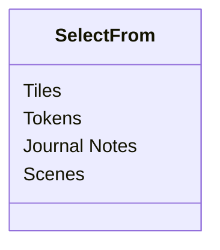

# Plutonium Settings Reference

# Config Window {.tabset}
## Actors
{.align-center}
> Experimental Settings: These settings may be incompatible with other modules, or even Foundry itself. If something doesn't work, turn these off first.
{.is-warning}

### Auto-Roll Multiattacks
Attempt to detect and automatically roll components of a creature's "Multiattack" sheet item on activation.
- [ ] Default Off
### Support Variables in Active Effect Values
Allows the use of roll syntax, and notably variables (such as `@abilities.dex.mod`), in active effect values.
- [x] Default On
## Art Browser
{.align-center}
### Drag-Drop Images As
The type of canvas object that should be created when drag-dropping images from the art browser to the canvas.

**Select from:**
- Tiles DEFAULT 
- Tokens
- Journal Notes
- Scenes
{.grid-list}

### Tile/Scene Scaling
A factor by which to scale placed tiles, and by which to scale scene backgrounds.
**Numeric input:** `1` Default
### Token Size
The default size of placed tokens.
- Medium or smaller DEFAULT
- Large
- Huge
- Gargantuan or Larger
{.grid-list}

### Activate Scenes on Creation
If enabled, a scene will be activated upon creation (by drag-dropping an image to the canvas).
- [x] Default On

### Display Scene Sheets on Creation
If enabled, the "sheet" (i.e., configuration UI) for a scene will be shown upon creation (by drag-dropping an image to the canvas).
- [x] Default On

### User Art Directory
The sub-directory of the "User Data" directory where downloaded images and image packs will be saved.
**Foundry path box:** `assets/art` default.

### Add Button To
The place(s) where the Art Browser button should be visible.
Multiselect
- [x] Token scene controls
- [x] Tile scene controls
- [x] Note scene controls
- [x] Scene controls

## Equipment Shop

Any content here will go into the third tab...

## Import

{.align-center}